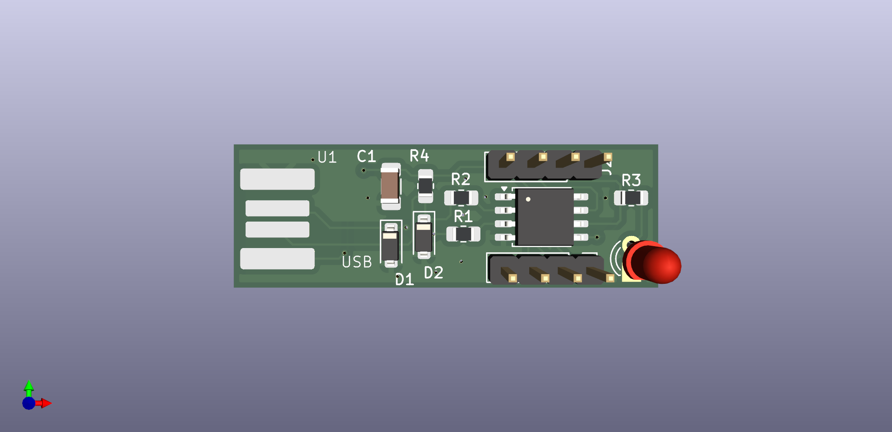

# ⚡ Digispark USB Development Board

A custom PCB clone of the Digispark development board — a minimal ATtiny85-based microcontroller board with native USB programming support. Designed from scratch in KiCad.



---

## What Is This

The original Digispark is a tiny Arduino-compatible board built around the ATtiny85. This is a custom PCB recreation of that design, including the USB low-speed interface circuit for programming directly over USB without a separate programmer.

The board breaks out all available ATtiny85 GPIO pins to two 4-pin headers for connecting peripherals.

---

## Circuit Overview

```
[USB Connector] → [USB Protection Circuit] → [ATtiny85] → [GPIO Headers]
```

**ATtiny85 Microcontroller**
8-pin AVR MCU running at up to 16.5 MHz (internal PLL clock when using Micronucleus bootloader). 6 usable GPIO pins (PB0–PB5), supports I2C, SPI, PWM, and ADC.

**USB Interface**
USB low-speed (1.5 Mbps) is bit-banged in software by the Micronucleus bootloader. The hardware side requires:
- Two 68Ω series resistors on D+ and D− lines (impedance matching)
- Two 3.6V Zener diodes (D1, D2) clamping the data lines to USB-safe voltage levels
- 1.5kΩ pull-up resistor (R4) on D+ to signal low-speed device to the host

**Decoupling**
100nF capacitor (C1) on the VCC pin filters supply noise close to the MCU.

**GPIO Headers**
J1 and J2 break out all ATtiny85 pins for connecting sensors, displays, or other peripherals.

---

## Pinout

| Pin | ATtiny85 | Function |
|-----|----------|----------|
| PB0 | Pin 5 | GPIO / PWM / AREF |
| PB1 | Pin 6 | GPIO / PWM |
| PB2 | Pin 7 | GPIO / I2C SDA / ADC1 |
| PB3 | Pin 2 | GPIO / ADC3 |
| PB4 | Pin 3 | GPIO / ADC2 |
| PB5 | Pin 1 | GPIO / RESET |

---

## Schematic

Designed in **KiCad 9.0.2**. Full schematic and PCB layout files included in the repository.

---

## Programming

Flash using the [Micronucleus bootloader](https://github.com/micronucleus/micronucleus) over USB, or use any AVR ISP programmer via the RESET/SPI pins on the header.

Compatible with Arduino IDE using the [Digistump ATtiny85 board package](https://github.com/digistump/DigistumpArduino).

---

## What I Learned

- USB low-speed electrical interface design (D+/D− termination, Zener clamping)
- ATtiny85 minimal circuit requirements
- PCB design for USB-connected embedded hardware in KiCad
- Impedance-sensitive routing for USB data lines

---

## Author

**Vladyslav Hirchuk** — [GitHub](https://github.com/SoloScriptSage) · [LinkedIn](https://linkedin.com/in/vladyslavhirchuk)